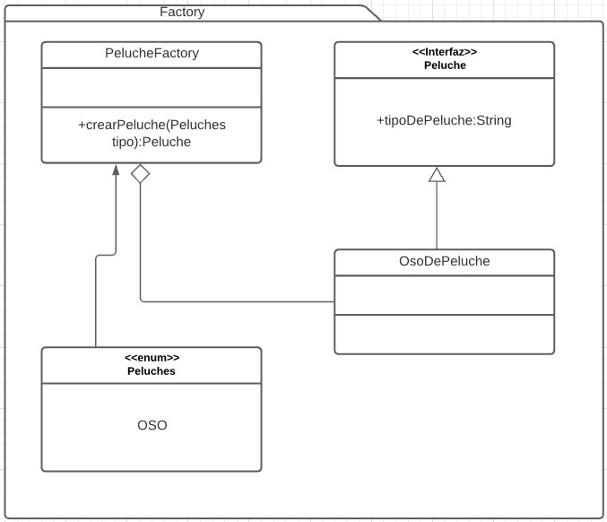

# Factory Pattern
Es un patron creacional. [Link descripcion](https://www.tutorialspoint.com/design_pattern/factory_pattern.htm)

En este patrón, se crea un objeto sin exponer la lógica de creación al cliente y se referencia al objeto a través de una interface en común.

## Diagrama de clases

## SOLID
* Single responsibility
	La clase factory idealmente tiene una sola razón para cambiar, cuando se implementen nuevas clases de la interfaz "Peluche"

* Open/Closed principle
	La clase factory debe ser modificada cada vez que necesitemos nuevas implementaciones de la interfaz Peluche, por lo que no se estaría cumpliendo este principio

* Liskov substitution principle
	Cualquier hijo del Factory debería comportarse como si fuera la propia factoria, este principio se cumple

* Inteface Segregation
	Las factorias idealmente tienen una interfaz muy reducida con un objetivo concreto, instanciar y devolver clases concretas, por lo que este principio se cumple

* Dependency inversion
	La factoria es muy util para cumplir con este principio en el contexto de un proyecto, aunque en sí no lo estaría cumpliendo ya que necesita conocer el tipo concreto de instancia a devolver, por lo que no puede depender de interfaces.